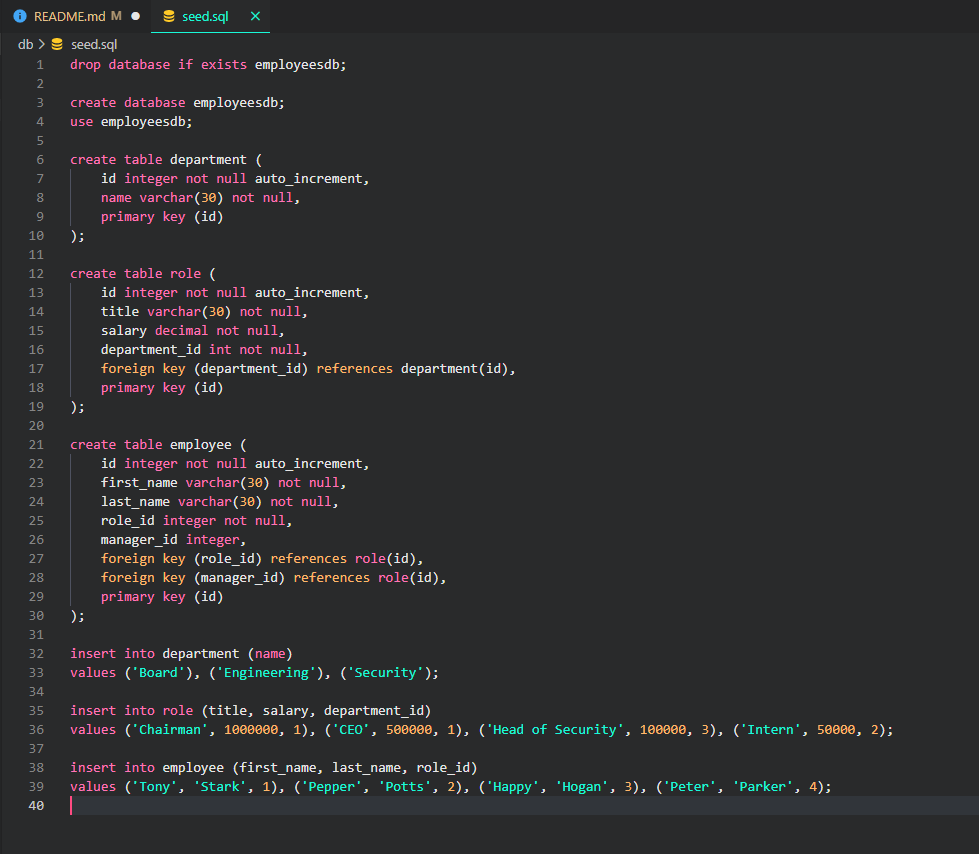
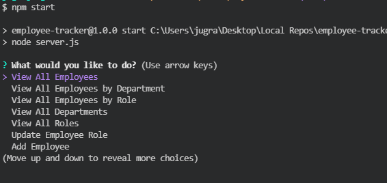

# Employee-Tracker

  
  ## Description

  An application designed to help the user creat an employee database, where the user will be able to:
   * Add employees, departments, & roles
   * View Employees, departments, & roles
   * Filter and view employees BY DEPARTMENTS AND ROLES
   * Also update roles of employees
  
  Employee data will consist of first and last name, department, their roles, and salary

  ## Table of Contents

  * [Installation](#installation)

  * [Usage](#usage)

  * [License](#license)

  * [Questions](#questions)

  
  ## Installation

  Type in command line: npm i  --> Will install all dependencies listed in package.json file

  ## Usage

  A prepopulated database for mysql will be required. Seed the .sql file to pif you need data.

  #### Database
  

  #### Application
  

  [Demo](https://drive.google.com/file/d/1QkASIkc3dMywO2CAyJfjBcN1uahocxVO/view)

  ## License
 Licensed under MIT

  ## Questions

  https://github.com/jugrajn

    - Reach me at jugraj.nijjar@gmail.com

